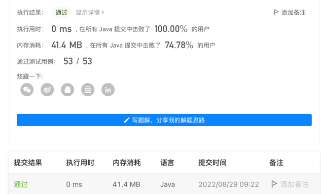
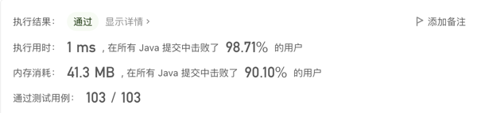
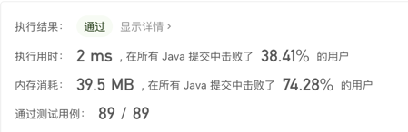
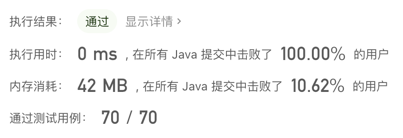
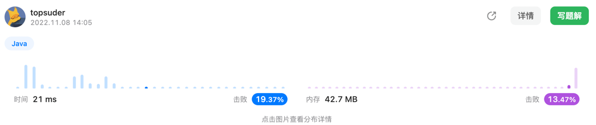

# leetCode-topsuder
〈力扣个人刷题代码仓库〉👾👾👾
## 记录耗时图

> 1470. 重新排列数组
```xpath2
src/main/java/fun/suder/leetcode2022_08_29/Solution.java
```


>【1475. 商品折扣后的最终价格】2022-09-01 每日一题
```xpath2
src/main/java/fun/suder/leetcode2022_09_01/Solution.java
```
```java
import java.util.Arrays;

class Solution {
    public int[] finalPrices(int[] prices) {
        final int pricesLength = prices.length;
        int[] ans = new int[pricesLength];
        for (int i = 0; i < pricesLength; i++) {
            int discount = 0;
            for (int j = i+1; j < pricesLength; j++) {
                if (prices[i]>=prices[j]){
                    discount = prices[j];
                    break;
                }
            }

            ans[i]=prices[i]-discount;
        }
        return ans;
    }

    public static void main(String[] args) {
        int[] ints = new int[]{10,1,1,6};
        System.out.println(Arrays.toString(new Solution().finalPrices(ints)));
    }
}
```



>【1592. 重新排列单词间的空格】2022-09-07 每日一题
```xpath2
src/main/java/fun/suder/leetcode2022_09_07/Solution.java
```
```java
package fun.suder.leetcode2022_09_07;


import java.util.ArrayList;
import java.util.List;
import java.util.Objects;

class Solution {
    public String reorderSpaces(String text) {
        String[] words =text.split(" ");
        int a = 0;
        List<String> strings = new ArrayList<>();

        for (String word : words) {
            if (!Objects.equals(word, "")) {
                strings.add(word);
            }
        }
        for (char c : text.toCharArray()) {
            if (c==' '){
                a++;
            }
        }
        if (a==0){
            return text;
        }
        if ((strings.size() - 1)==0) {
            String s = strings.get(0);
            for (int i = 0; i < a; i++) {

                s +=" ";
            }
            return s;
        }
        final int yu = a % (strings.size() - 1);
        int i = 0 ;
        if (yu==0) {
            i=a/(strings.size()-1);
        }else {
            i=(a-yu)/(strings.size()-1);
        }
        String str = "";
        for (int i1 = 0; i1 < strings.size(); i1++) {
            str+= strings.get(i1);
            if (i1!=strings.size()-1){
                for (int j = 0; j < i; j++) {
                    str+=" ";
                }
            }else {
                if (yu!=0){
                    for (int i2 = 0; i2 < yu; i2++) {
                        str+=" ";
                    }
                }
            }
        }
        return str;
    }

    public static void main(String[] args) {
        System.out.println(new Solution().reorderSpaces(" a"));
    }

}
```



>【667. 优美的排列 II】2022-09-08 每日一题
```xpath2
src/main/java/fun/suder/leetcode2022_09_07/Solution.java
```
```java
package fun.suder.leetcode2022_09_08;

import java.util.Arrays;

class Solution {
    public int[] constructArray(int n, int k) {
        int[] ans = new int[n];
        int kUp = k + 1;
        int numTemp = 1;
        //下标段[0, k]中，偶数下标填充[1,2,3..]
        for (int i = 0; i <= k; i += 2){
            ans[i] = numTemp++;
        }
        //下标段[0, k]中，奇数下标填充[k + 1, k, k - 1...]
        for (int i = 1; i <= k; i += 2){
            ans[i] = kUp--;
        }
        //下标段[k + 1, n - 1]都是顺序填充
        for (int i = k + 1; i < n; ++i) {
            ans[i] = i + 1;
        }
        return ans;
    }

    public static void main(String[] args) {
        System.out.println(Arrays.toString(new Solution().constructArray(3, 2)));
    }
}
```


> 1684. 统计一致字符串的数目
```java
class Solution {
    public int countConsistentStrings(String allowed, String[] words) {
        boolean[] flags = new boolean[words.length];
        for (int i = 0; i < words.length; i++) {
            for (char c : words[i].toCharArray()) {
                if (!allowed.contains(String.valueOf(c))){
                    flags[i] = true;
                    break;
                }
            }
        }
        int count = 0;
        for (boolean flag : flags) {
            if (!flag){
                count++;
            }
        }
        return count;
    }
}
```
